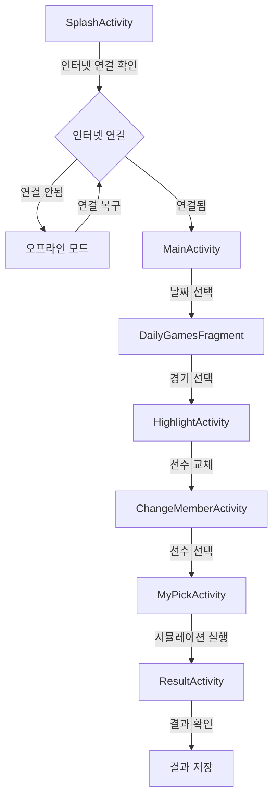
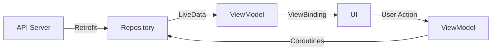

# 🏟️ Baseball Simulation Application

<div align="center">
  
  
  
  
</div>

## 📋 프로젝트 소개
이 프로젝트는 야구 경기 시뮬레이션을 위한 Android 애플리케이션입니다. 실제 야구 경기의 상황을 시뮬레이션하고, 선수 교체에 따른 승률 변화를 예측하는 기능을 제공합니다. AI 기술을 활용하여 선수들의 성적과 경기 상황을 분석하여 더 정확한 시뮬레이션 결과를 제공합니다.

## 🎯 주요 기능
### ⚾ 경기 시뮬레이션
- **실시간 상황 분석**
  - 이닝별 상황 파악
  - 베이스 상황 표시
  - 아웃 카운트 관리
  - 점수 표시

- **선수 교체 시뮬레이션**
  - 타자/투수 교체 시 승률 변화 예측
  - 선수별 상세 스탯 비교
  - 교체 전/후 승률 변화 그래프

### 📊 데이터 관리
- **경기 일정**
  - 2024 시즌 전체 일정 제공
  - 날짜별 필터링

- **선수 정보**
  - 타자 스탯 (타율, 홈런, 타점 등)
  - 투수 스탯 (ERA, 승리, 세이브 등)
  - 실시간 선수 교체 정보

## 📱 화면 구성

### 🏠 메인 화면
- 일별 경기 일정 표시
- 날짜 네비게이션

### 🎮 경기 상세 화면
- 경기 정보 표시
- 하이라이트 정보
- 선수 교체 기능

### 🎲 시뮬레이션 화면
- 선수 선택
- 승률 예측
- 결과 표시

## 🏗️ 시스템 아키텍처

### 🔄 아키텍처 패턴
- MVVM (Model-View-ViewModel) 패턴 사용
- Repository 패턴으로 데이터 관리
- ViewBinding을 통한 UI 바인딩
- Coroutines를 활용한 비동기 처리

### 🧩 주요 컴포넌트
1. **UI Layer**
   - Activities: MainActivity, HighlightActivity, MyPickActivity, ResultActivity
   - Fragments: DailyGamesFragment
   - ViewModels: 각 화면별 ViewModel

2. **Data Layer**
   - Repository: GameRepository, HighlightRepository
   - Models: GameModel, Player, HighlightData
   - Network: Retrofit을 통한 API 통신

3. **Domain Layer**
   - Use Cases: 경기 시뮬레이션 로직
   - Business Logic: 승률 계산, 선수 교체 로직

## 🔄 앱 흐름도



### 📱 주요 화면 흐름
1. **SplashActivity**
   - 앱 시작 화면
   - 인터넷 연결 상태 확인
   - 로고 애니메이션 표시

2. **MainActivity**
   - 일별 경기 일정 표시
   - ViewPager2를 통한 날짜 네비게이션

3. **DailyGamesFragment**
   - 선택된 날짜의 경기 목록 표시
   - 경기 상세 정보 제공

4. **HighlightActivity**
   - 경기 하이라이트 정보 표시
   - 선수 교체 시점 표시

5. **ChangeMemberActivity**
   - 선수 교체 기능
   - 라인업 정보 표시

6. **MyPickActivity**
   - 선수 선택 및 비교
   - 시뮬레이션 시작

7. **ResultActivity**
   - 시뮬레이션 결과 표시
   - 승률 변화 그래프 표시

## 📊 데이터 흐름


## 🛠️ 기술 스택
<div align="center">
  <table>
    <tr>
      <td align="center">
        
        <br>Kotlin
      </td>
      <td align="center">
        
        <br>Android SDK
      </td>
    </tr>
  </table>
</div>

## 📱 시스템 요구사항
- Android SDK 33 이상
- Kotlin 1.9.0 이상
- Android Studio Hedgehog 이상

## 🔧 설치 방법
1. 프로젝트를 클론합니다:
```bash
git clone [repository-url]
```

2. Android Studio에서 프로젝트를 엽니다.

3. 필요한 의존성을 설치합니다:
```bash
./gradlew build
```

4. 앱을 실행합니다.

## 📈 성능 최적화

### 🖼️ 이미지 최적화
- Glide를 사용한 이미지 캐싱
- 이미지 크기 최적화
- 메모리 관리

### 🌐 네트워크 최적화
- Retrofit 캐싱
- API 응답 최적화
- 오프라인 지원

## 🔐 보안

### 🔒 데이터 보안
- API 키 보안
- 사용자 데이터 보호
- 네트워크 통신 암호화

### 🔑 권한 관리
- 인터넷 접근 권한
- 네트워크 상태 확인 권한

## 📄 라이센스
이 프로젝트는 MIT 라이센스를 따릅니다.
